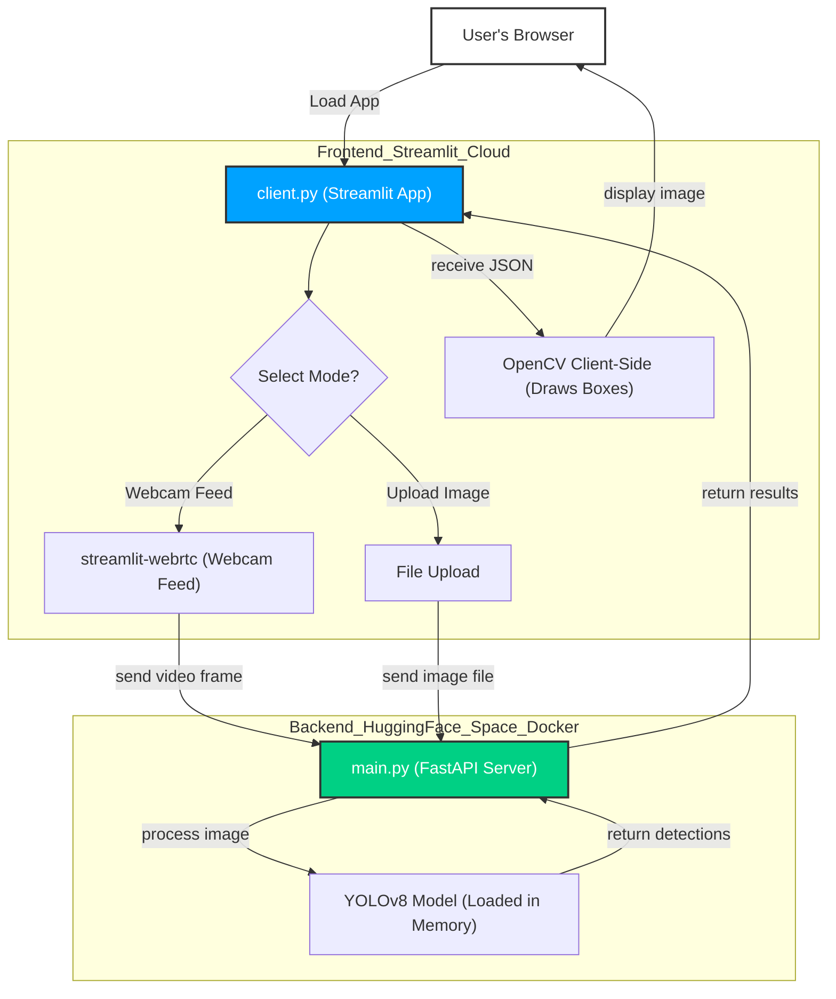

# Real-Time Occupancy Counter API

A full-stack, AI-powered web application that detects and counts people in real-time from video streams or static images.

This project demonstrates a production-ready, decoupled architecture:

- **Backend:** A **FastAPI** + **YOLOv8** object detection API, containerized with **Docker**.
- **Frontend:** A **Streamlit** web app that acts as a client to the API.

---

## Features

- **Real-Time Webcam Detection:** Uses `streamlit-webrtc` to send webcam frames to the API and draw bounding boxes on the live feed.
- **Static Image Upload:** A "Before & After" view for counting people in uploaded JPG/PNG files.
- **Dockerized Backend:** The entire FastAPI backend, including the 500MB+ of ML libraries (PyTorch, OpenCV), is packaged in a single Docker container.
- **Decoupled Architecture:** The Streamlit frontend is _completely separate_ from the AI backend. This is a scalable, real-world design.

---

## Quality Assurance & Model Validation

As a QA-first project, this API includes a robust testing pipeline to ensure model reliability and endpoint stability before deployment.

- **API Regression Testing:** Maintained a Dockerized Postman test suite covering 30 distinct API test scenarios (positive, negative, boundary, and malformed payloads) against the FastAPI endpoints.
- **Model Precision Baseline:** Evaluated the `yolov8n` model against a curated dataset of 200+ images spanning eight core COCO object categories.
- **Edge-Case Detection:** Identified and documented 12 specific edge-case failures (e.g., partial occlusions, low-light conditions, and extreme angles).
- **Metrics:** Established a **94.2% precision baseline** and an 89% recall rate, setting the benchmark for future CI/CD model regression checks.

To view the testing artifacts, check the `tests/` directory.

## Technical Stack

- **AI / ML:** `ultralytics/yolov8n` (YOLOv8 Nano)
- **Backend API:** `fastapi`, `uvicorn`
- **Deployment:** `docker`
- **Frontend Client:** `streamlit`, `streamlit-webrtc`, `requests`
- **Core Libraries:** `opencv-python`, `pillow`, `numpy`

---

## How to Run This Project

### 1. Run the Backend (Docker)

The backend API **must** be running for the client to work.

1.  Clone this repository.
2.  Make sure you have [Docker Desktop](https://www.docker.com/products/docker-desktop/) installed and running.
3.  Navigate to the project directory and build the Docker image:
    ```bash
    docker build -t person-counter-api .
    ```
4.  Run the container:
    ```bash
    docker run -d -p 8000:8000 --name person-api person-counter-api
    ```
5.  The API is now live at `http://127.0.0.1:8000`. You can see the docs at `http://127.0.0.1:8000/docs`.

### 2. Run the Frontend (Streamlit)

1.  In a **new terminal**, set up a Python virtual environment:
    ```bash
    python -m venv venv
    source venv/bin/activate  # On Windows: .\venv\Scripts\activate
    ```
2.  Install the client-side requirements:
    ```bash
    pip install streamlit streamlit-webrtc requests opencv-python pillow
    ```
3.  Run the Streamlit app:
    ```bash
    streamlit run client.py
    ```
4.  Your browser will open to `http://localhost:8501`.

---

# About:

This project is not a single, monolithic app. It's a decoupled, client-server system, which is a modern, scalable approach to building AI applications.

The Frontend (Streamlit) is completely separate from the Backend (FastAPI). This means the AI model can be scaled, updated, or maintained independently without ever taking down the user-facing app.

Step-by-Step Breakdown:
Load App: The user visits the public Streamlit Cloud URL.

Send Frame: When the user uploads an image or starts their webcam, the Streamlit app (frontend) sends that single frame as an HTTP POST request to our public Hugging Face Space API.

Process: The FastAPI backend (running in its Docker container on Hugging Face) receives the image.

Detect: The YOLOv8 model inside the container processes the image and finds all "person" objects.

Respond: The API sends back a clean JSON response (e.g., {"person_count": 2, "detected_objects": [...]}).

Display: The Streamlit app receives this JSON, uses OpenCV to draw the bounding boxes from the coordinates, and displays the final annotated image back to the user—all in a fraction of a second.

## Application Architecture & Workflow

This project uses a decoupled, 3-tier architecture. The **Frontend Client (Streamlit)** is completely separate from the **Backend AI (FastAPI)**, which runs as a scalable microservice in its own container.



## Project Structure

```
cv_api/
├── .dockerignore # Ignores venv and cache
├── Dockerfile # Blueprint for the backend API container
├── main.py # The FastAPI backend API server
├── client.py # The Streamlit frontend web app
├── requirements.txt # Python libraries for the backend (used by Docker)
└── my_test_image.jpg # An image for testing
```
